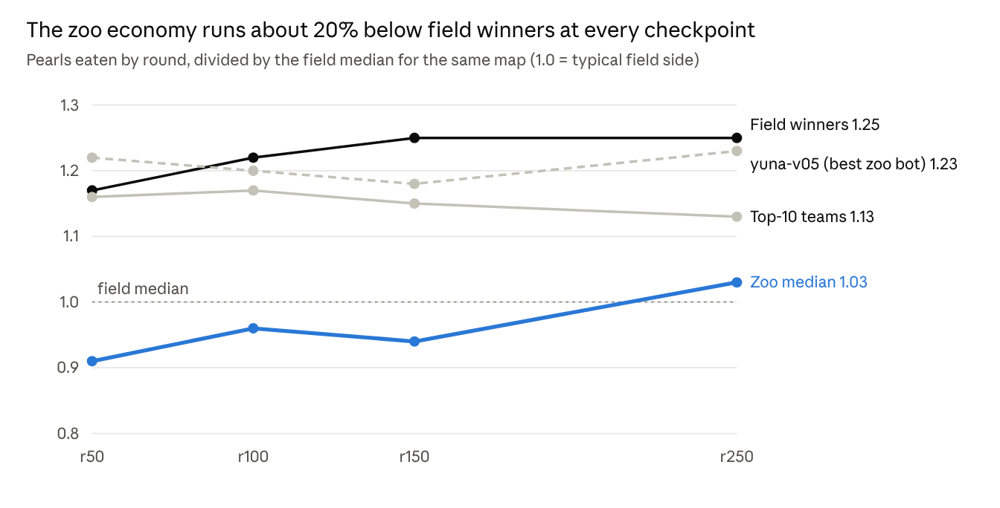

# Benchmark features for local optimisation

29 September 2026 · claude/analysis/F1 (with the user). Exported from the Claude Doc of the same name; data and code in `docs/analysis/benchmarks/` and `tools/analysis/features/benchmarks.py`.

## Summary

Optimise locally against three things. First, a **map-normalised economy curve**: pearls eaten at r50, r100, r150 and r250, divided by the field's median for that map. Second, **dragons and length at r100 on the same scale**. Third, a **hygiene group of self-inflicted death rates**. Use opponent-relative shares only as outcome proxies against a fixed panel.

- **Stripping context works, but the two kinds of stripping do different jobs.**
  - Dividing by the field's per-map median removes most of the map effect: in the field, the map's share of variance falls from 0.74 to 0.13. It adds little opponent noise (0.10) and puts the zoo and the field on one scale.
  - Taking the share against the opponent (ours / (ours + theirs)) removes the map entirely. It predicts results best (field log-odds per sd 1.10–1.58 vs 0.76–0.89 for the map-normalised version) and carries best across maps.
  - The cost of the relative version: 26–30% of its variance is *who you played*, so it is only comparable within a fixed opponent panel.
- **The economy gap is about 20% and consistent.** The zoo's median economy sits at 0.91–1.03 of the field median at every checkpoint. Field winners sit at 1.17–1.25 and the top ten teams at 1.13–1.17. Our best bots (chaewon-y04 1.28, yuna-v05 1.20 at r100) already match winners early.
- **Self-inflicted deaths behave like hygiene, not strategy.**
  - They are the most stable metrics we have (seed ICC 0.91–0.98, opponent share ≤ 0.09). They are the most bot-owned (the same team ranks the same on other maps: 0.6–0.86 correlation in the field).
  - The top ten teams have a median of 0 wall and self deaths, against 4.0 and 3.0 per 1k dragon-turns in the zoo.
  - But they do not predict a team's rating (ρ ≈ 0). Within a game they even come slightly with winning (+0.20 log-odds live), because busy, winning swarms also bump into themselves more.
  - So they are safe to push down, as long as the economy curve does not drop.

Measuring against the field, on its average, its top ten and its full distribution, holds up. The field percentile on the same map is the best-behaved yardstick: it strips the most map and needs the fewest games, for example 13 side-games instead of 20 for kelp deaths. Report each benchmark as absolute, gap to the top ten, and field percentile, and optimise on the percentile.

## What makes a metric safe to optimise

A benchmark earns its place on six measured properties. Each was computed for 46 candidate metrics on the z1 zoo panel (560 seed-1 games, 80 fixtures × 3 seeds) and on 4,563 field games from 143 teams.

| Property | Why it matters | Measured as |
| --- | --- | --- |
| Low seed noise | A change must show up without thousands of games | Seed ICC: share of variance that survives re-seeding the same fixture |
| Bot-owned | An optimiser can only move what the bot controls | Share of within-map variance explained by which bot played |
| Low opponent contamination | Otherwise gains depend on who is in the panel | Share explained by the opponent, after the bot |
| Carries across maps | Final maps are out of sample | Leave-one-map-out rank correlation of bot (zoo) or team (field) means |
| Wins games | Otherwise it is style, not strength | Log-odds of winning per within-map sd, with the zoo rating or the Elo expected score held fixed |
| Same sign live | Local gains must mean something live | The field coefficient has the same sign and similar size as the zoo's |

A metric that is stable and bot-owned but not win-relevant is **hygiene**: reduce it, but never trade economy for it. A metric that wins games but is opponent-contaminated is an **outcome proxy**: compare it only against the same opponent panel.

## Does stripping context help?

Yes, keep the idea, but use each version for its own job. Map normalisation is the default yardstick. Opponent-relative shares predict results best, but they are only fair against a fixed panel.

| Metric (pearls eaten by r100) | Map share of variance (zoo / field) | Opponent share (zoo / field) | Seed ICC | Cross-map consistency (zoo / field) | Log-odds per sd (zoo / field) |
| --- | --- | --- | --- | --- | --- |
| Raw count `pearls@100` | 0.89 / 0.74 | 0.01 / 0.02 | 0.97 | 0.34 / 0.28 | 1.04 / 0.76 |
| Map-normalised `pearls@100\|map` | 0.45 / 0.13 | 0.10 / 0.09 | 0.77 | 0.35 / 0.34 | 1.04 / 0.76 |
| Capacity-normalised `bed_yield@100` | 0.60 / 0.61 | 0.07 / 0.05 | 0.79 | 0.35 / 0.29 | 1.05 / 0.79 |
| Opponent-relative `pearls@100\|rel` | 0 / 0 | 0.28 / 0.23 | 0.68 | 0.49 / 0.37 | 1.26 / 1.10 |
| Relative rate `pearls_per100dt_0_100\|rel` | 0 / 0 | 0.28 / 0.24 | 0.69 | 0.35 / 0.31 | 0.81 / 0.58 |

- **The raw count's high seed ICC is flattery.** Its stability comes from the map (89% of its variance), and the map is exactly what will be new in the final.
- **Dividing by bed capacity does not remove the map.** Maps differ in how reachable their beds are, not just in how many they have. So `bed_yield` stays 60% map. The empirical per-map median works better.
- **The relative share adds signal and adds the opponent.** It raises the win coefficient by a quarter to a half and carries best across maps (0.49). But 23–30% of its variance is the opponent, and its seed ICC falls to 0.68.
- **Relative-and-map combined is redundant.** A share against the opponent in the same game is already map-free: the map share is exactly 0.

The map-normalised numbers use the field's own per-map medians (`benchmarks/map_reference_medians.json`). That fixes the yardstick outside our zoo, so zoo runs, field games and future bots are all measured on the same scale. On an out-of-sample map, the reference is simply the first few hundred games of that map.

## Relative to the field: average, top and rank

Measuring against the field works, and the best form is a side's **percentile among field sides on the same map**. It keeps everything map normalisation gives, strips more of the map, and cuts the noise further, most of all for deaths.

| Version | Map share (zoo) | Bot share | Opponent share | Cross-map (zoo) | Side-games for half a bot-sd |
| --- | --- | --- | --- | --- | --- |
| Pearls at r100 ÷ field median | 0.45 | 0.25 | 0.10 | 0.35 | ~52 |
| Pearls at r100 ÷ top-10 median | 0.30 | 0.33 | 0.12 | 0.27 | ~47 |
| Pearls at r100 ÷ field 90th percentile | 0.29 | 0.34 | 0.12 | 0.29 | ~47 |
| Pearls at r100 field percentile | 0.22 | 0.39 | 0.12 | 0.30 | ~44 |
| Kelp deaths per 1k, absolute | 0.34 | 0.47 | 0.03 | 0.60 | ~20 |
| Kelp deaths, excess over field median | 0.09 | 0.65 | 0.04 | 0.60 | ~20 |
| Kelp deaths field percentile | 0.08 | 0.74 | 0.03 | 0.76 | ~13 |
| All self-inflicted deaths, absolute | 0.47 | 0.30 | 0.05 | 0.31 | ~39 |
| All self-inflicted deaths field percentile | 0.15 | 0.51 | 0.09 | 0.39 | ~30 |

- **Average, top and rank are one scale with different zero points.** Within a map they order sides identically, so their win signal is the same (pearls at r100: 1.04 log-odds zoo, 0.76 field). What differs is how much map is left over and how noisy the number is.
- **The percentile strips the most map and is the cheapest to measure.** Kelp-death percentile resolves a change in about 13 side-games instead of 20. It carries across maps at 0.76 instead of 0.60.
- **Ratio to the top does not work for deaths.** The top-10 median is 0 for four of the five death rates on most maps, so a ratio divides by zero. For deaths, use the excess over the top in deaths per 1k, or the percentile.
- **The percentile has a ceiling for zero-inflated rates.** 30–50% of field sides have zero kelp deaths on each map, so a perfect bot scores about 0.75–0.85, not 1. Read it as the share of the field you beat, with ties counted half.

Where our zoo stands on each yardstick. Each cell reads zoo median / field winners / top-10 teams.

| Economy metric | ÷ field median (1 = average) | ÷ top-10 median (1 = top) | Field percentile |
| --- | --- | --- | --- |
| Pearls at r50 | 0.91 / 1.17 / 1.16 | 0.79 / 1.00 / 1.00 | 0.44 / 0.61 / 0.60 |
| Pearls at r100 | 0.96 / 1.22 / 1.17 | 0.79 / 1.04 / 1.00 | 0.47 / 0.63 / 0.59 |
| Pearls at r150 | 0.94 / 1.25 / 1.15 | 0.78 / 1.08 / 1.00 | 0.46 / 0.64 / 0.58 |
| Pearls at r250 | 1.03 / 1.25 / 1.13 | 0.89 / 1.11 / 1.00 | 0.52 / 0.65 / 0.58 |
| Dragons at r100 | 0.89 / 1.28 / 1.14 | 0.76 / 1.02 / 1.00 | 0.41 / 0.66 / 0.64 |
| Length at r100 | 0.87 / 1.26 / 1.15 | 0.75 / 1.04 / 1.00 | 0.39 / 0.67 / 0.64 |
| Births by r100 | 0.91 / 1.23 / 1.16 | 0.77 / 1.05 / 1.00 | 0.45 / 0.63 / 0.59 |

| Death rate (per 1k dragon-turns) | Absolute | Excess over field median | Excess over top-10 median | Field percentile (higher = fewer) |
| --- | --- | --- | --- | --- |
| All self-inflicted | 12.97 / 12.66 / 9.83 | +2.67 / +1.03 / −1.24 | +3.71 / +2.36 / 0.00 | 0.36 / 0.44 / 0.58 |
| Kelp | 4.01 / 2.12 / 0.00 | +1.18 / +0.22 / −0.48 | +3.40 / +1.66 / 0.00 | 0.40 / 0.48 / 0.75 |
| Own body | 3.00 / 2.15 / 0.00 | +1.63 / +0.33 / −0.71 | +2.94 / +2.12 / 0.00 | 0.35 / 0.46 / 0.78 |
| Ally body | 1.51 / 1.14 / 0.56 | +0.51 / +0.16 / −0.28 | +0.92 / +0.48 / 0.00 | 0.37 / 0.45 / 0.65 |
| Ally head-on | 0.79 / 0.45 / 0.50 | +0.38 / 0.00 / +0.03 | +0.19 / 0.00 / 0.00 | 0.35 / 0.52 / 0.49 |

On economy, the zoo median beats 39–52% of field sides, field winners beat 61–67%, and the top ten beat 58–64%. On self-inflicted deaths, the zoo median beats only 35–40%, against 44–52% for winners and 49–78% for the top ten.

Recommendation: report every benchmark as three numbers: the absolute value, the gap to the top ten (ratio for economy, excess per 1k for deaths), and the field percentile. Optimise on the percentile. The per-map references are fixed files: `field_references.json` holds the median, p10, p25, p75, p90 and top-10 median per map, and `field_distributions.json` holds the full sorted field values that percentiles are read from.

## The benchmark set

The set has three tiers. Tier 1 is what to push up. Tier 2 is what to push down without losing tier 1. Tier 3 is what to watch against a fixed panel. Values are medians per side-game. `|map` means divided by the field's median on the same map, so 1.0 is a typical field side.

*z1 zoo panel (seed 1, 1,120 side-games) and 4,563 corpus games from 28 Sep 2026; medians per side-game.*

The best zoo bots already eat like field winners. yuna-v05 is at 1.20 and chaewon-y04 at 1.28 at r100. They fail to *keep* it: their length at r100 is only 0.91–1.00 of the field median, against 1.26 for winners. So the curve to raise is the one in the chart, and the gap to close first is retention.

| Tier | Metric | Direction | Zoo | Field | Field winners | Top 10 | Target |
| --- | --- | --- | --- | --- | --- | --- | --- |
| 1 Economy | Economy curve `pearls@{50,100,150,250}\|map` | up | chart | 1.00 | chart | chart | ≥ 1.20 at every checkpoint |
| 1 Economy | Dragons at r100 `units@100\|map` | up | 0.89 | 1.00 | 1.28 | 1.14 | ≥ 1.15 |
| 1 Economy | Length at r100 `total@100\|map` | up | 0.87 | 1.00 | 1.26 | 1.15 | ≥ 1.15 |
| 1 Economy | Births by r100 `births@100\|map` | up | 0.91 | 1.00 | 1.23 | 1.16 | ≥ 1.15 |
| 1 Economy | Early concentration `top1_share@100` | down | 0.11 | 0.10 | 0.08 | 0.08 | ≤ 0.09 |
| 2 Hygiene | Kelp deaths `death_wall_per1k` | down | 4.01 | 2.22 | 2.12 | 0.00 | < 1 |
| 2 Hygiene | Own-body deaths `death_self_per1k` | down | 3.00 | 1.81 | 2.15 | 0.00 | < 1 |
| 2 Hygiene | Ally-body deaths `death_ally_body_per1k` | down | 1.51 | 0.98 | 1.14 | 0.56 | < 0.8 |
| 2 Hygiene | Ally head-on deaths `death_h2h_ally_per1k` | down | 0.79 | 0.31 | 0.45 | 0.50 | < 0.5 |
| 2 Hygiene | No-valid-action deaths `death_invalid_per1k` | down | 0.00 | 0.00 | 0.00 | 0.00 | 0 (ouroboros-m01 has 10.9: a bug) |
| 3 Proxy | Bed capture `bed_capture_share` | up | 0.46 | 0.46 | 0.61 | 0.54 | beat the same panel |
| 3 Proxy | Pearl share at r150 `pearls@150\|rel` | up | 0.50 | 0.50 | 0.62 | 0.55 | beat the same panel |
| 3 Proxy | Territory at r100 `territory@100` | up | 0.50 | 0.50 | 0.58 | 0.52 | beat the same panel |
| 3 Proxy | Length share at r250 `total_share@250` | up | 0.50 | 0.50 | 0.76 | 0.60 | beat the same panel |

Death rates are per 1,000 dragon-turns. Tier 3 medians are 0.50 by construction, so only the winners' column carries information.

Six of eight zoo bots share the kelp and self-collision habit; kazuha-s01 and ouroboros-m01 already have zero kelp deaths. All self-inflicted deaths together (`avoidable_deaths_per1k`) run at a median of 13.0 per 1,000 dragon-turns in the zoo, against 11.9 in the field and 9.8 for the top ten teams.

## Guardrails: how each metric can blow up

Optimise tier 1 and tier 2 jointly, and accept a change only if the win rate against the panel does not drop. Each metric below has a cheap way to game it that loses games.

- **Fewer self-inflicted deaths by playing small.** kazuha-s01 and hunter-v20 have the fewest self-inflicted deaths in the zoo (7.9 and 9.7 per 1k) and win 19% and 12%. Hygiene counts only when the economy curve holds or rises in the same run.
- **Economy curve by splitting into dust.** Births and pearls rise when a bot splits constantly into 2-segment children. Guard with `newborn_deaths10_per100` (zoo 33 per 100 births; the field is the same, winners 31). Also guard with length at r100, which must rise with pearls. The retention gap in the chart is this failure already happening.
- **Low concentration by never building a crown.** `top1_share@100` should be low early. `total_share@250` (log-odds 2.2 zoo, 2.4 field) and the final longest dragon still decide games, so check the r250 share whenever early concentration moves.
- **Relative shares by picking soft opponents.** A tier 3 metric is only comparable against the same panel on the same maps and seeds. Never compare tier 3 numbers across panels.
- **Map-normalised numbers on maps without a reference.** For a new map the reference median does not exist. Use the tier 1 raw numbers against our own previous bot on the same map until about 200 field games give a median.

Three tempting metrics should stay diagnostics, not targets:

- `kill_length_ratio` — the sign runs against intuition (log-odds −1.2 zoo, −1.1 field) and is unexplained.
- Kill counts — most kills are mutual head-on collisions, so both sides score them.
- `enemy_caused_deaths_per1k` — it strongly predicts losing (−1.5). But it is 16% opponent and shows no cross-map consistency in the zoo (−0.03), so it is not a bot trait.

## How to use it

One candidate against the z1 panel is 140 side-games: 7 opponents × 10 live maps × 2 seats, at seed 1. That is enough to see a change of half the typical gap between two zoo bots on every tier 1 and tier 2 metric.

| Metric | Side-games to resolve half a between-bot sd |
| --- | --- |
| Kelp deaths | ~20 |
| All self-inflicted deaths | ~40 |
| Pearls at r50 / r100 / r150 / r250, map-normalised | ~45 / 50 / 45 / 60 |
| Dragons / length at r100, map-normalised | ~70 / 80 |
| Bed capture, pearl share (relative) | ~55 |

These are 80% power and 5% two-sided, from the residual spread after map, bot and opponent. A change a third that size needs about 2.8× as many games, so add seed 2 when a decision is close.

1. Run the candidate against the fixed panel: `python -m tools.analysis.features.run_panel` with the candidate added to `ZOO`, seed 1, `--no-logs`.
2. Extract features: `python -m tools.analysis.features extract build/zoo/<panel>/replays --out … --cache …`.
3. Score it: `python -m tools.analysis.features.benchmarks`. This adds the `|map`, `|rel`, `|top`, `|xs`, `|xstop` and `|pct` columns from the fixed field references in `field_references.json` and `field_distributions.json`, so every run is on the same yardstick.
4. Accept a change when:
   - tier 1 rises by at least 0.05 of field median on the mean of the four economy checkpoints, with dragons and length at r100 not falling;
   - no tier 2 rate rises by more than 10%;
   - the win rate against the panel does not fall.

   Otherwise rerun at seed 2 before deciding.

A single-bot scorecard (one command, one row per candidate, deltas against its parent) does not exist yet. It is the obvious next thing to build on top of `benchmarks.py`.

## Evidence

Every candidate screened, grouped by family.

- **Bot share / opponent share:** shares of within-map variance in the zoo (seed 1).
- **Cross-map:** leave-one-map-out rank correlation of bot means (zoo) or team means (field: 85 teams with at least 40 side-games).
- **Log-odds:** per within-map sd, holding the zoo rating (zoo) or the Elo expected score (field) fixed.
- **Team ρ:** Spearman correlation of a team's mean with its latest rating.

| Metric | Kind | Seed ICC | Bot share | Opp share | Cross-map zoo | Log-odds zoo | Log-odds field | Team ρ rating | Cross-map field |
| --- | --- | --- | --- | --- | --- | --- | --- | --- | --- |
| `top1_share@100` | raw | 0.76 | 0.26 | 0.08 | 0.43 | -1.17 | -0.90 | -0.42 | 0.32 |
| `bed_yield@100` | capacity | 0.79 | 0.14 | 0.07 | 0.35 | 1.05 | 0.79 | 0.51 | 0.29 |
| `bed_yield@250` | capacity | 0.84 | 0.19 | 0.10 | 0.27 | 1.45 | 1.00 | 0.43 | 0.31 |
| `pearls@50\|map` | map | 0.67 | 0.34 | 0.06 | 0.42 | 0.78 | 0.58 | 0.46 | 0.31 |
| `pearls@100\|map` | map | 0.77 | 0.25 | 0.10 | 0.35 | 1.04 | 0.76 | 0.46 | 0.34 |
| `pearls@150\|map` | map | 0.81 | 0.28 | 0.13 | 0.44 | 1.22 | 0.85 | 0.45 | 0.35 |
| `pearls@250\|map` | map | 0.76 | 0.30 | 0.16 | 0.42 | 1.36 | 0.89 | 0.39 | 0.33 |
| `pearls_per100dt_0_100\|map` | map | 0.76 | 0.38 | 0.05 | 0.34 | 0.52 | 0.31 | 0.28 | 0.34 |
| `pearls@100` | raw | 0.97 | 0.07 | 0.01 | 0.34 | 1.04 | 0.76 | 0.46 | 0.28 |
| `pearls_per100dt_0_100` | rate | 0.89 | 0.29 | 0.04 | 0.31 | 0.52 | 0.31 | 0.28 | 0.34 |
| `pearls_per100dt_100_250` | rate | 0.91 | 0.32 | 0.04 | 0.27 | 0.33 | -0.04 | 0.09 | 0.45 |
| `epg_conversion` | rate | 0.88 | 0.11 | 0.03 | 0.12 | 0.22 | 0.11 | 0.10 | 0.31 |
| `bed_capture_share` | relative | 0.76 | 0.39 | 0.26 | 0.49 | 2.13 | 1.83 | 0.38 | 0.42 |
| `bed_pearls@100\|rel` | relative | 0.69 | 0.38 | 0.28 | 0.48 | 1.28 | 1.15 | 0.32 | 0.37 |
| `pearls@50\|rel` | relative | 0.63 | 0.35 | 0.26 | 0.42 | 0.82 | 0.80 | 0.25 | 0.30 |
| `pearls@100\|rel` | relative | 0.68 | 0.39 | 0.28 | 0.49 | 1.26 | 1.10 | 0.32 | 0.37 |
| `pearls@150\|rel` | relative | 0.75 | 0.40 | 0.29 | 0.46 | 1.56 | 1.30 | 0.35 | 0.40 |
| `pearls@250\|rel` | relative | 0.76 | 0.41 | 0.30 | 0.50 | 1.88 | 1.58 | 0.37 | 0.43 |
| `pearls_per100dt_0_100\|rel` | relative | 0.69 | 0.39 | 0.28 | 0.35 | 0.81 | 0.58 | 0.18 | 0.31 |
| `total@100` | raw | 0.89 | 0.09 | 0.06 | 0.16 | 1.31 | 1.08 | 0.57 | 0.32 |
| `total@100\|map` | map | 0.69 | 0.26 | 0.19 | 0.23 | 1.31 | 1.08 | 0.57 | 0.37 |
| `units@100\|map` | map | 0.72 | 0.29 | 0.19 | 0.27 | 1.35 | 1.04 | 0.55 | 0.39 |
| `total_share@100` | relative | 0.65 | 0.35 | 0.25 | 0.43 | 1.52 | 1.55 | 0.43 | 0.39 |
| `units_share@100` | relative | 0.67 | 0.35 | 0.26 | 0.45 | 1.58 | 1.46 | 0.39 | 0.41 |
| `total_share@250` | relative | 0.67 | 0.36 | 0.26 | 0.59 | 2.19 | 2.37 | 0.47 | 0.45 |
| `births@100\|map` | map | 0.77 | 0.26 | 0.10 | 0.48 | 1.10 | 0.75 | 0.49 | 0.34 |
| `births@100\|rel` | relative | 0.69 | 0.39 | 0.29 | 0.45 | 1.29 | 1.12 | 0.33 | 0.35 |
| `newborn_deaths10_per100` | rate | 0.92 | 0.30 | 0.07 | 0.15 | -0.24 | -0.36 | 0.06 | 0.35 |
| `territory@100` | relative | 0.65 | 0.33 | 0.24 | 0.51 | 1.78 | 1.63 | 0.44 | 0.37 |
| `seen_share@100` | capacity | 0.87 | 0.17 | 0.04 | 0.61 | 0.93 | 0.47 | 0.33 | 0.55 |
| `death_wall_per1k` | rate | 0.94 | 0.47 | 0.03 | 0.60 | 0.06 | -0.02 | 0.04 | 0.80 |
| `death_self_per1k` | rate | 0.96 | 0.33 | 0.06 | 0.50 | 0.59 | 0.21 | -0.12 | 0.78 |
| `death_ally_body_per1k` | rate | 0.91 | 0.40 | 0.09 | 0.61 | 0.63 | 0.21 | -0.03 | 0.72 |
| `death_h2h_ally_per1k` | rate | 0.98 | 0.41 | 0.02 | 0.19 | 0.24 | 0.06 | -0.15 | 0.60 |
| `death_invalid_per1k` | rate | 0.98 | 0.85 | 0.00 | 1.00 | 0.06 | 0.03 | -0.22 | 0.86 |
| `avoidable_deaths_per1k` | rate | 0.96 | 0.30 | 0.05 | 0.31 | 0.52 | 0.20 | 0.00 | 0.52 |
| `avoidable_deaths_per1k\|map` | map | 0.75 | 0.43 | 0.10 | 0.36 | 0.52 | 0.20 | 0.00 | 0.52 |
| `avoidable_deaths_per1k\|rel` | relative | 0.73 | 0.42 | 0.31 | 0.42 | 0.79 | 0.42 | 0.03 | 0.50 |
| `avoidable_death_share` | rate | 0.77 | 0.21 | 0.15 | 0.37 | 1.35 | 0.68 | -0.11 | 0.52 |
| `deaths_per1k` | rate | 0.96 | 0.30 | 0.07 | 0.12 | -0.26 | -0.51 | 0.08 | 0.48 |
| `deaths_per1k\|rel` | relative | 0.79 | 0.40 | 0.29 | 0.09 | -0.31 | -0.65 | -0.10 | 0.40 |
| `enemy_caused_deaths_per1k` | rate | 0.86 | 0.13 | 0.16 | -0.03 | -1.51 | -1.48 | 0.01 | 0.43 |
| `death_rate_enclosed_per1k` | rate | 0.75 | 0.20 | 0.05 | 0.23 | -0.11 | -0.48 | -0.19 | 0.50 |
| `enclosed_share_mean` | rate | 0.92 | 0.16 | 0.03 | 0.25 | 0.25 | 0.20 | 0.14 | 0.31 |
| `kill_length_ratio` | relative | 0.80 | 0.14 | 0.15 | 0.19 | -1.20 | -1.06 | -0.01 | 0.31 |
| `sprint_cost_per_pearl` | rate | 0.85 | 0.50 | 0.05 | 0.88 | -0.64 | -0.19 | 0.18 | 0.85 |

Sources: the z1 panel (1,120 seed-1 side-games plus 320 side-games at seeds 2–3) and 4,563 public corpus games from 28 Sep 2026 (10:15–20:43 UTC). Regenerate with `tools/analysis/features/benchmarks.py`; the full screen is `benchmark_screen.csv`.
