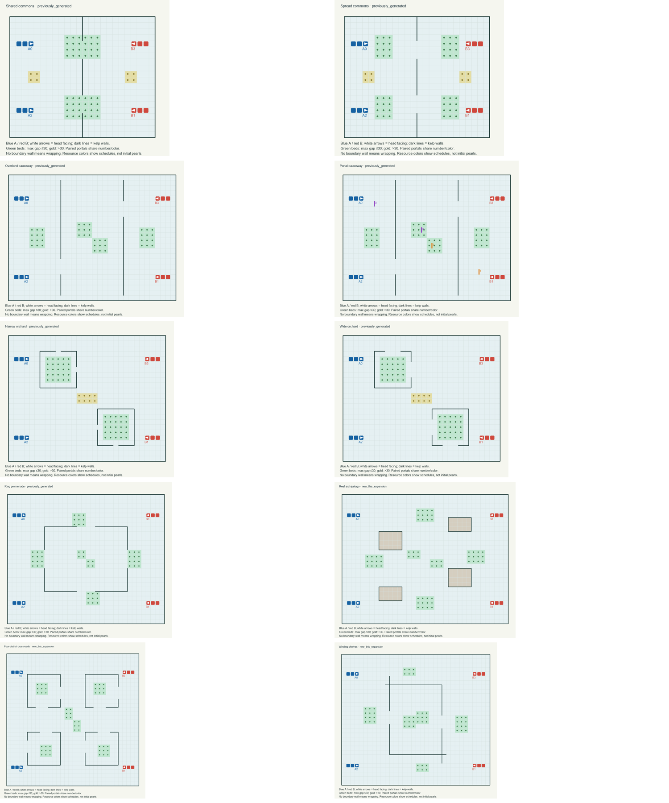
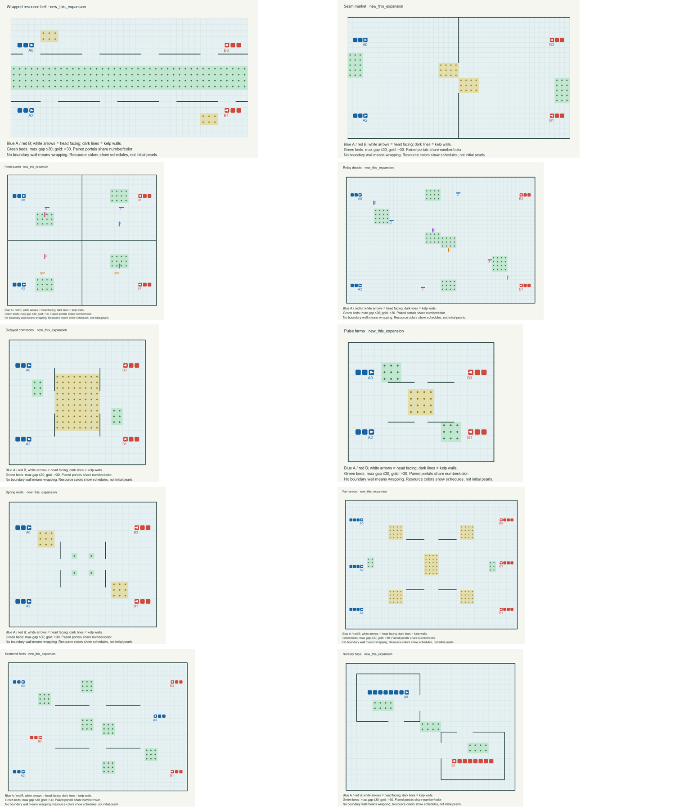

# Twenty maps for broader finals preparation

The **20 new synthetic maps are directly in `maps/new/`**, alongside [their map weights](training_map_weights.csv), [optional game weights](training_game_weights.csv) and [manifest](manifest.json). Paths in these files are relative to this directory. Per-map cards and previews are included below. The complete replay and validation package was stored in the original local `experiment_data/map_coverage_20260927_091715/` directory and is not included by default; the tracked maps, weights, manifest and cards remain available here.

**The first three were survivors of strict cutting inside a narrow search, not the best or most diverse set that could be made.** The initial search concentrated on three main families. It generated 24 variants, screened 12, and retained three under the attached prompt’s combined plausibility, mechanism and fairness gates. Two additional ring reserves were kept outside that funnel. Those were useful editorial gates for a small diagnostic suite, but too restrictive for your clarified goal of covering unfamiliar finals designs. This was structured screening, not statistical certification that the three were superior to every rejected map.

This expansion supplies **20 playable synthetic layouts**, with **13 newly designed maps and 7 byte-identical carryovers**, across **17 named motif families and 8 broader related groups**. There is no seed, reflection or size padding in the 20. All have positive plausibility-based weights. The old report and its accept/quarantine decisions remain unchanged as historical records.

Download the 20-map bundle (`../../experiment_data/map_coverage_20260927_091715/coverage_maps_20.zip`) · [Map weights](training_map_weights.csv) · [Machine-readable manifest](manifest.json) · Game diagnostics (`../../experiment_data/map_coverage_20260927_091715/validation/game_diagnostics.json`)

## What “new” and “old” mean

- **Original/reference maps:** the 13 established maps in the repository, plus older reserves, transforms and toolkit copies in the 80-file reference inventory. None is relabeled as a new design or included among these 20. Their file hashes were checked unchanged. See old reference inventory (`../../experiment_data/map_coverage_20260927_091715/old_reference_atlas.json`).
- **Reused prior synthetic maps:** the two commons, two causeways, two orchards and one ring promenade. Three were previously accepted, three were quarantined by the stricter fairness gate, and the ring was previously unplayed. All seven are exact copies. The ring has now been played and is no longer a fresh holdout in this expanded suite. Its sibling s1 remains outside this suite.
- **New this expansion:** 13 explicit designs, semantically distinct from each other and the audited old/reference/generated inventory. Semantic identity accounts for symmetry transforms and renaming; distinct hashes do not prove independent strategic families.

## Plausibility and weights

Each map has a **0–1 design-plausibility confidence**, ranging from **0.76 to 0.93**. This judges whether its geometry, supply, routes and counterplay form a coherent human-authored addition. It is **not a calibrated probability of appearing in finals, being fair, or improving training**. The hundredths provide a deterministic ranking, not measurement precision; small score differences should not be overinterpreted.

The scale is qualitative: around 0.90 is a conservative, coherent extension; around 0.80–0.89 adds a stronger interaction or unusual resource/deployment idea; around 0.70–0.79 is a credible but more speculative extrapolation. Portal quartet and Pulse farms occupy the lower end because mandatory portal dependence and synchronized schedules carry stronger assumptions. Every card gives a rationale and a design caveat. These are judgments by the generating agent, not an independent blinded review.

Scores were frozen after structural/visual review and before the 28 new smoke-game outcomes. Results of the six reused primary maps were already known; their reassessment is explicitly marked as having prior gameplay exposure. Scores were not subsequently tuned to winners. The old batch’s 0.845/0.850 values were composite curation/evidence scores on a different scale; they must not be compared directly with this batch’s plausibility scores.

Use `recommended_map_weight` in the CSV for the coverage-oriented default:
```text
raw_weight(map) = plausibility(map) / selected_maps_in_its_motif_family
recommended_map_weight = raw_weight / sum(raw_weight over all 20 maps)
```
This prevents the three retained sibling pairs from doubling their family’s influence. It preserves graded plausibility across families rather than demanding uniformity. `ungrouped_map_weight = plausibility / sum(plausibility)` is also supplied for pure map-level weighting. Both distributions sum to one **within this synthetic suite**. Choose the original-versus-synthetic mixture separately; no score here estimates that mixture.

For training or validation splits, keep each `dataset_split_group` together, including all future siblings and transforms. The eight groups are a conservative grouping within this suite, not proof of independence from analogous original maps. For an unseen-family evaluation, also group original maps by shared motifs when appropriate. Once these maps or their outcomes are used for tuning, do not label them unseen finals-like holdouts.

## The maps

| Map / detail card | Provenance | Main coverage idea | Plausibility | Recommended weight | Games |
|---|---|---|---:|---:|---:|
| [Shared commons](cards/md26_commons_shared_s0.md) | Reused | centralized income, renewable contest | 0.93 | 3.21% | 6 |
| [Spread commons](cards/md26_commons_spread_s0.md) | Reused | distributed income, conversion | 0.93 | 3.21% | 6 |
| [Overland causeway](cards/md26_causeway_detour_s0.md) | Reused | overland detours, gate choice | 0.90 | 3.10% | 6 |
| [Portal causeway](cards/md26_causeway_portal_s0.md) | Reused | optional shortcuts, exit risk | 0.92 | 3.17% | 6 |
| [Narrow orchard](cards/md26_orchard_narrow_s0.md) | Reused | productive rooms, narrow exits | 0.88 | 3.03% | 6 |
| [Wide orchard](cards/md26_orchard_wide_s0.md) | Reused | productive rooms, wide exits | 0.90 | 3.10% | 6 |
| [Ring promenade](cards/md26_promenade_ring_s0.md) | Reused | ring routes, inner outer supply | 0.87 | 6.00% | 2 |
| [Reef archipelago](cards/mc26_archipelago.md) | New | reef detours, distributed income, intentional inaccessible terrain | 0.84 | 5.79% | 2 |
| [Four-district crossroads](cards/mc26_crossroads.md) | New | multi room, hub control, flanking | 0.89 | 6.14% | 2 |
| [Winding shelves](cards/mc26_pinwheel.md) | New | bent routes, pockets, multi route | 0.85 | 5.86% | 2 |
| [Wrapped resource belt](cards/mc26_equatorial_belt.md) | New | toroidal, continuous resource band, gate choice | 0.85 | 5.86% | 2 |
| [Seam market](cards/mc26_seam_market.md) | New | cylinder, large area short contact, boundary supply | 0.88 | 6.07% | 2 |
| [Portal quartet](cards/mc26_portal_quartet.md) | New | mandatory portals, route memory opportunity, multiple exits | 0.76 | 5.24% | 2 |
| [Relay depots](cards/mc26_relay_depots.md) | New | multi link portals, remote income, optional shortcuts | 0.82 | 5.66% | 2 |
| [Delayed commons](cards/mc26_delayed_commons.md) | New | delayed income, changing opportunity, initial scarcity | 0.83 | 5.72% | 2 |
| [Pulse farms](cards/mc26_pulse_farms.md) | New | synchronized supply, compact, timing | 0.79 | 5.45% | 2 |
| [Spring wells](cards/mc26_spring_wells.md) | New | few fast beds, harvest capacity, fallback supply | 0.85 | 5.86% | 2 |
| [Far harbors](cards/mc26_far_harbors.md) | New | large area, remote income, six spawns, exploration | 0.89 | 6.14% | 2 |
| [Scattered fleets](cards/mc26_scattered_fleets.md) | New | interleaved deployment, local fronts, six spawns | 0.81 | 5.59% | 2 |
| [Nursery bays](cards/mc26_nursery_bays.md) | New | long initial bodies, split space, protected opening | 0.84 | 5.79% | 2 |

Weights above are rounded for display; use full precision from the CSV. Every card links its `.map`, preview, evidence, score rationale and limitations.




## Validation and gameplay evidence

All **20** loaded in the installed engine and passed **360 terrain/portal transition probes**, **328 opening probes**, and **4 resource-timing cases**. Static checks covered symmetry of terrain/resources/body facing, continuous non-overlapping bodies, portal pairing through engine loading, and reachable active beds. Every starting dragon has at least two unoccupied legal moves. This checks the opening and topology; it does not guarantee survival under a particular policy. See engine checks (`../../experiment_data/map_coverage_20260927_091715/validation/engine_checks.json`).

One Winding shelves draft enclosed an unintended basin and failed the hard reachability check. It was rejected and repaired with mirrored three-cell openings **before gameplay**; the failed draft and repair explanation remain in `rejected_designs/`. Reef archipelago intentionally contains 70 unreachable empty reef cells, shown grey; they contain no active beds or initial bodies. Portal quartet intentionally needs portals to connect its four chambers. Both sides can reach every active bed through the complete movement graph.

There are **64 competitive fixtures: 28 newly run and 36 reused exactly**. The 36 historical games cover six carryover layouts with three opponent pairs, both sides. The 28 new games cover the 13 new maps plus the previously unplayed ring, using one pair per map, both sides. Fafnir is the common anchor; Ouroboros and Valjean alternate in the new smoke schedule. The historical panel also includes von_neumann-x06-info, whose optional information changes are default-off. Frozen source hashes, exact map hashes and installed engine identity are recorded in the fixture manifest (`../../experiment_data/map_coverage_20260927_091715/match_manifest.json`).

Native runs used the unchanged 500-round limit, 64-unit limit and fixed engine RNG seed `0x5eed5eed`, with two workers and 240-second timeouts. These deterministic side swaps are controls, not independent random trials. No bots were tuned, no shared game ledger was edited, and no new judge CPU-budget certification was performed. The installed engine binary differs from the bundled repository binary; validation and games consistently used the installed one.

All 64 replays were decoded and checked against their map hashes, winners, round counts and terminal states. Runtime-fault fixtures: **0**. Conservative usable fixtures: **60/64**. The excluded fixtures contain no-action/invalid-death flags; some bots deliberately feed by returning no action late in a game, so such deaths are not automatically runtime crashes or bad maps. The exact death records are preserved for decision review.

At least one same-side sweep appeared on **12 of 20 maps**: the same side won both games despite swapping the bots. With this small, deterministic panel, that is a reason to investigate orientation, initiative and policy interactions, not a reliable estimate of unfairness. Those maps retain their plausibility weights. Cards preserve the old side/orientation concerns rather than erasing them.

The replay summaries report actual resource harvest, splits and portal use. Those establish basic activity, not the advertised mechanism’s causal benefit. For example, crossing a portal does not show that memory helped, and reaching a food cell does not show optimal exploration. Terrain distance is not tactical travel time. Scheduled resource attempts are not realized supply: occupancy and uncollected pearls suppress spawning. The delayed and pulsed maps use normal engine renewal bounds throughout, not new game rules.

The optional [game-weight file](training_game_weights.csv) divides a map’s weight across its fixtures so maps with six historical games do not dominate maps with two. `all_fixture_weight` includes every completed game and its flags. `conservative_game_weight` gives zero to ambiguous fixtures and reallocates only within that same map’s usable fixtures. If a map has no usable fixture, its mass stays unallocated rather than silently moving to another family. Current unallocated mass: 0.000000. **Map weights stay positive regardless.**

## Coverage and remaining uncertainty

The expansion crosses eight broad areas: resource geography/timing; optional shortcuts/dividers; productive rooms/deployment; loops/detours; open navigation; wrapped contact; portal dependence; and dispersed deployment. It includes both stronger extrapolations and familiar combinations. This is broader than 20 variations of one room or portal layout.

It is still a designed sample, not a learned distribution of future finals maps. All 20 use rotational team symmetry; most food appears in regular patches; only a few starting-body/deployment patterns are represented. Asymmetric objectives, changed rules, arbitrary huge maps and extreme stress-only constructions are outside this suite. The 17 motif IDs are bookkeeping, not 17 proven independent latent types. No map selection or confidence update was based on achieving a desired win rate.

Next testing should preserve this breadth: rotate additional frozen strategy approaches across all 20, add orientation controls, and review flagged side effects and no-action fixtures. Promote or adjust scores only with a documented new assessment, keeping these frozen scores and the current evidence intact.

## Reproduction and provenance

The original experiment directory contained `sources/` snapshots, `candidates/`, a historical copy of the 20 maps, all 64 replay/result/log triples, structural evidence, the failed pre-game draft, and the frozen score file; that local evidence package is not included here. The compact ZIP omits the bulky game files; its per-game links need the full evidence package or this workspace. Integrity checks (`../../experiment_data/map_coverage_20260927_091715/validation/integrity_checks.json`) confirm original/reference maps, prior generated maps, the old report, and all copied historical game files were preserved.

Previous batch: `map_discovery_20260927_083913`. This batch: `map_coverage_20260927_091715`. Generation is deterministic (`explicit-design-v2`); new maps reproduce byte-for-byte. Scripts are `tools/map_discovery/coverage.py`, `validate.py`, `coverage_screen.py`, and `coverage_finish.py`, with exact copies under `sources/`. Reproduction should target a fresh output directory using the saved `SPECIFICATION.md`, the previous batch and the recorded engine/bot snapshots; do not overwrite the historical batch.

Installed engine SHA-256: `48d249aa9cd98cba947e3cf51d731da5cb8da0a2bcddf89a02ca96880216aedd`.
